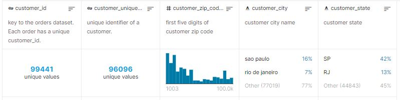
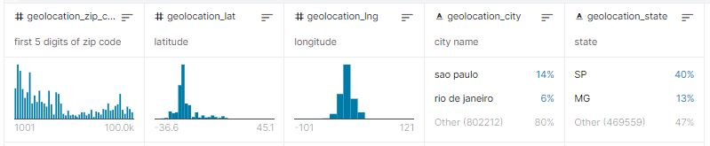
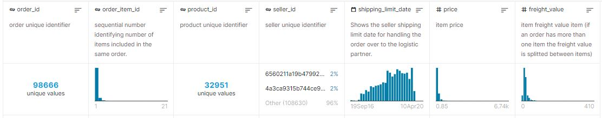
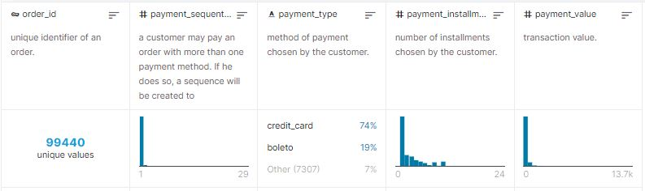
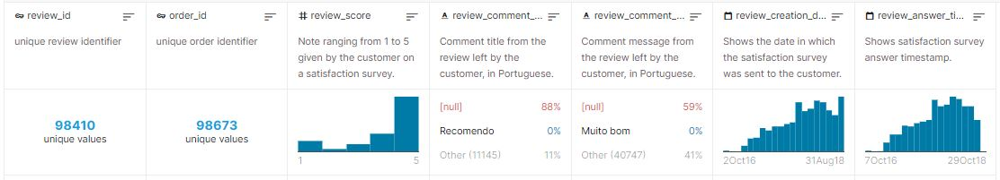
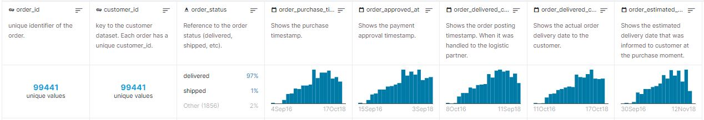
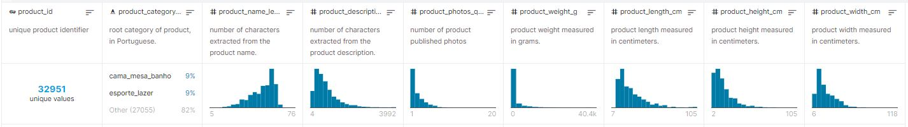
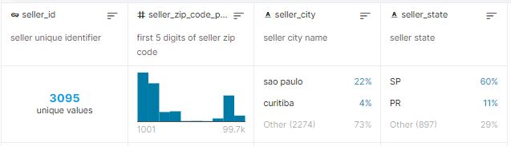
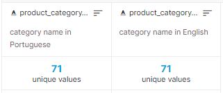

# Datasets

## Customers Dataset

This dataset has information about the customer and its location. Use it to identify unique customers in the orders dataset and to find the orders delivery location.

At our system each order is assigned to a unique customerid. This means that the same customer will get different ids for different orders. The purpose of having a ``customerunique_id`` on the dataset is to allow you to identify customers that made repurchases at the store. Otherwise you would find that each order had a different customer associated with.

## Geolocation Dataset

This dataset has information Brazilian zip codes and its lat/lng coordinates. Use it to plot maps and find distances between sellers and customers.

## Order Items Dataset

This dataset includes data about the items purchased within each order.

Example:

The order_id = 00143d0f86d6fbd9f9b38ab440ac16f5 has 3 items (same  product). 

Each item has the freight calculated accordingly to its measures and weight. To get the total freight value for each order you just have to sum.

The total order_item value is: 21.33 * 3 = 63.99

The total freight value is: 15.10 * 3 = 45.30

The total order value (product + freight) is: 45.30 + 63.99 = 109.29

## Payments Dataset

This dataset includes data about the orders payment options.

## Order Reviews Dataset

This dataset includes data about the reviews made by the customers.

After a customer purchases the product from Olist Store a seller gets notified to fulfill that order. Once the customer receives the product, or the estimated delivery date is due, the customer gets a satisfaction survey by email where he can give a note for the purchase experience and write down some comments.

## Orders Dataset

This is the core dataset. From each order you might find all other information.

## Products Dataset

This dataset includes data about the products sold by Olist.

## Sellers Dataset

This dataset includes data about the sellers that fulfilled orders made at Olist. Use it to find the seller location and to identify which seller fulfilled each product.

## Category Name Translation

Translates the ``product_category_name`` to english.

